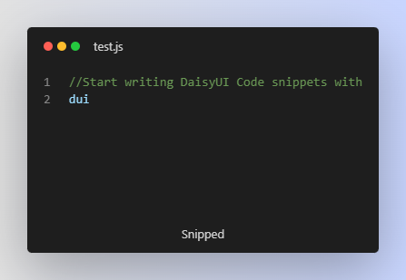

# daisyui-snippets README




## Shortcuts 

```

        "duibtn": "Buttons with brand colors"

    
        "duidropdown": "Dropdown can open a menu or any other element when the button is clicked."
    

        "duimodal": "Modal goes bottom on mobile screen and goes middle on desktop"
    

        "duiswap": "# Activate using class name instead of checkbox"
    

        "duiaccord": "# Accordion with arrow icon"
    
    
        "duialert": "Alert"
    

        "duiavatar": "Avatar"
    
    
        "duibadge": "Badge"
    
    
        "duicard": "Card"
    
    
        "duicard-overlay": "Card-Overlay"
    
    
        "duichat": "Chat"
    
    
        "duicollapse": "Collapse"
    
    
        "duicountdown": "Countdown"
    
    
        "duikbd": "Kbd"
    
    
        "duiloading-dots": "Loading-dots"
    
    
        "duiloading-spinner": "Loading-spinner"
    
    
        "duiloading-ring": "Loading-ring"
    
    
        "duiprog": "Progress"
    
    
        "duiprog-radial": "Progress-radial"
    
    
        "duistat": "Stats"
    
    
        "duitable": "Table"
    
    
        "duitooltip": "Tooltip"
    
    
        "duicheckbox": "Checkbox"
    
    
        "duifile": "File-Input"
    
    
        "duiradio": "Radio"
    
    
        "duirange": "Range"
    
    
        "duirate-star": "Rating-star"
    
    
        "duirate-heart": "Rating-heart"
    
    
        "duiselect": "Select"
    
    
        "duiinput": "Input"
    
    
        "duitextarea": "TextArea"
    
    
        "duitoggle": "Toggle"
    
    
        "duiartboard": "Artboard"
    
    
        "duidivider": "Divider"
    
    
        "duidrawer": "Drawer"
    
    
        "duifooter": "Footer"
    
    
        "duihero": "Hero"
    
    
        "duiindicator": "Indicator"
    
    
        "duijoin": "Join"
    
    
        "duimask": "Mask"
    
    
        "duistack": "Stack"
    
    
        "duitoast": "Toast"
    
    
        "duibread": "BreadCrumbs"
    
    
        "duibtm-nav": "Bottom-Navigation"
    
    
        "duilink": "Link"
    
    
        "duimenu": "Menu"
    
    
        "duinav": "Navbar"
    
    
        "duipage": "Pagination"
    
    
        "duisteps": "Steps"
    
    
        "duitab": "Tab"
    
    
        "duicode": "Code"
    
    
        "duiphone": "Phone"
    
    
        "duiwindow": "Window"
    

```
## Features


> Supports latest DaisyUI components
> Updated Weekly
> Open Source
> Compatiable with JS,VUE,React.
> Contains 53+ Latest Code snippets from Daisy UI,for blazing fast development ⚡

## Requirements

None

## Extension Settings

None

## Known Issues

None

## Release Notes

Users appreciate release notes as you update your extension.

### 1.0.0

Initial release of Daisy UI Snippets 

### 1.1.0

Added Support for Vue/Javascript/React

---


## For more information

* [Visual Studio Code's Markdown Support](http://code.visualstudio.com/docs/languages/markdown)
* [Markdown Syntax Reference](https://help.github.com/articles/markdown-basics/)

**Enjoy!**
